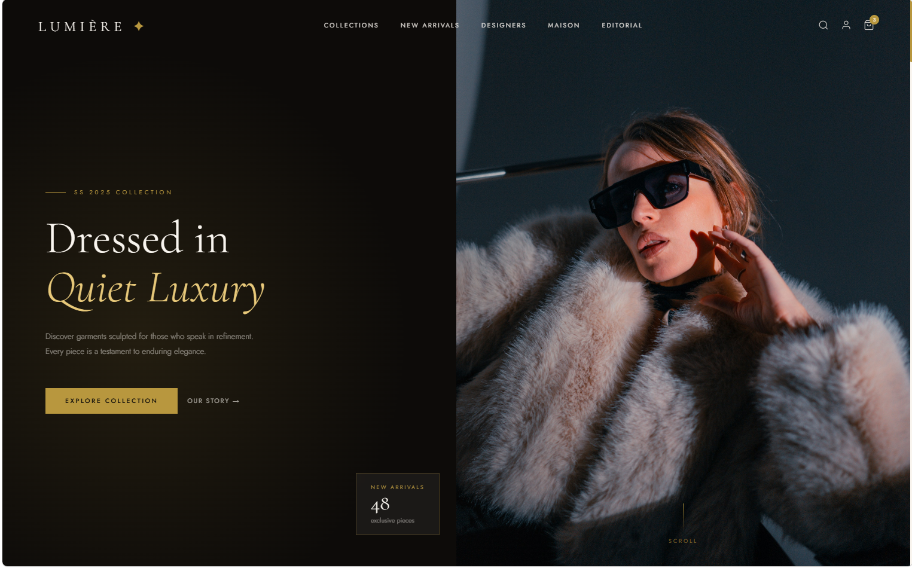

# Lumière Boutique ✦

> *A sanctuary for those who regard dressing as an art form.*

A fully responsive luxury fashion e-commerce single-page application built with **React** and **Vite**. Lumière Boutique features a complete shopping experience — from browsing curated collections to a multi-step checkout — wrapped in an editorial aesthetic inspired by the world's finest fashion houses.

---

## Live Preview



---

## Features

### Storefront
- Full-screen hero section with animated entrance
- Animated gold ticker banner with promotional messages
- Curated collections grid (3 editorial cards)
- New arrivals product grid with category filtering (All / Women / Men / Accessories)
- Lifestyle editorial banner with quote overlay
- Brand story / Maison section with statistics
- Designer profiles grid (4 featured designers)
- Client testimonials section
- Newsletter subscription with validation

### Shopping Experience
- **Add to Cart** — products added from grid with live confirmation flash
- **Wishlist** — heart toggle per product, persists during session
- **Cart Drawer** — slide-out panel with product thumbnails, quantity controls, and item removal
- **Live subtotal** — recalculates in real time as quantities change
- **Cart badge** — live item count on the navbar icon

### Checkout
- **Step 1 — Delivery Details** — full form with inline validation (name, email, phone, address, city, postal code)
- **Step 2 — Payment** — three methods:
  - 💳 Credit / Debit Card (auto-formatted card number, expiry, CVV)
  - 🏦 EFT with bank details and unique reference number
  - ⚡ PayFast redirect flow
- **Step 3 — Order Confirmation** — personalised thank-you with order reference and delivery address

### Navigation & Modals
- Fixed navbar with scroll transition (transparent → frosted glass)
- Hamburger menu on mobile with smooth dropdown
- **Search overlay** — full-screen with quick-filter tag pills
- **Account modal** — tabbed Sign In / Create Account forms with validation
- **Services modals** — Personal Styling, Alterations, Returns, Shipping, Care Guide, Contact
- **Legal modals** — Privacy Policy, Terms & Conditions, Cookie Policy
- Fully functional footer with all links wired

### Responsive Design
- Mobile-first CSS media queries in a single `index.css`
- Breakpoints: Desktop (1024px+), Tablet (768–1024px), Mobile (≤768px), Small Mobile (≤480px)
- Hamburger navigation on mobile
- Stacked layouts for all grids on small screens
- Full-width cart and modals on mobile
- Payment form fields stack vertically on mobile

---

## Tech Stack

| Technology | Purpose |
|---|---|
| React 18 | UI framework |
| Vite | Build tool & dev server |
| CSS Media Queries | Responsive layout |
| Google Fonts | Cormorant Garamond + Jost typography |
| Inline Styles + CSS Classes | Component styling |

No external UI libraries. No CSS frameworks. Zero third-party dependencies beyond React itself.

---

## Project Structure

```
src/
├── main.jsx                          # App entry point
├── App.jsx                           # Root — all state & logic lives here
├── index.css                         # All global styles & responsive media queries
├── constants/
│   └── theme.js                      # Colours, fonts, product/collection/designer data
└── components/
    ├── Placeholder.jsx               # Image placeholder (swap with  when ready)
    ├── Navbar.jsx                    # Fixed nav with hamburger menu
    ├── Hero.jsx                      # Full-screen hero section
    ├── Ticker.jsx                    # Animated promotional banner
    ├── Collections.jsx               # Editorial collections grid
    ├── FeaturedProducts.jsx          # Filtered product grid
    ├── ProductCard.jsx               # Individual product card
    ├── LifestyleBanner.jsx           # Editorial quote banner
    ├── About.jsx                     # Brand story section
    ├── Designers.jsx                 # Designer profiles
    ├── Testimonials.jsx              # Client reviews
    ├── Newsletter.jsx                # Email subscription
    ├── Footer.jsx                    # Site footer
    ├── CartPanel.jsx                 # Slide-out cart drawer
    └── modals/
        ├── SearchModal.jsx           # Full-screen search overlay
        ├── AccountModal.jsx          # Sign In / Create Account
        ├── ServicesModal.jsx         # Client services detail
        ├── LegalModal.jsx            # Privacy, Terms, Cookies
        └── PaymentModal.jsx          # 3-step checkout flow
```

---

## Getting Started

### Prerequisites

- [Node.js](https://nodejs.org/) v18 or higher
- npm v9 or higher

### Installation

**1. Clone the repository**
```bash
git clone https://github.com/patfarmurs/lumiere-boutique.git
cd lumiere-boutique
```

**2. Scaffold Vite (first time only)**
```bash
npm create vite@latest . -- --template react
```
When prompted to overwrite, type `y` and press Enter. Then replace the generated `src/` folder with the one from this repository.

**3. Install dependencies**
```bash
npm install
```

**4. Start the development server**
```bash
npm run dev
```

Open [http://localhost:5173](http://localhost:5173) in your browser.

### Build for Production

```bash
npm run build
```

The optimised output will be in the `dist/` folder, ready to deploy to any static host (Vercel, Netlify, GitHub Pages).

---

## Adding Your Own Images

All images currently use a styled placeholder component. To swap in real photos:

**1. Create the images folder**
```
public/
└── images/
    ├── hero.jpg
    ├── about.jpg
    ├── lifestyle.jpg
    ├── collections/
    │   ├── evening-couture.jpg
    │   ├── resort-wear.jpg
    │   └── tailored-suiting.jpg
    ├── products/
    │   ├── silk-dress.jpg
    │   ├── chiffon-gown.jpg
    │   └── ... (13 product images)
    └── designers/
        ├── elise.jpg
        ├── marcus.jpg
        ├── aiko.jpg
        └── zara.jpg
```

**2. Replace placeholders in each component**

Find `<Placeholder label="..." />` and replace with:
```jsx

```

**3. Add images to data arrays in `theme.js`**

For products, collections, and designers — add an `image` field:
```js
{ id:1, name:"Silk Crepe Midi Dress", ..., image:"/images/products/silk-dress.jpg" }
```

### Recommended Image Sources
- [Unsplash](https://unsplash.com) — free, high-quality, commercial use allowed
- Search terms: `luxury fashion editorial`, `haute couture`, `fashion atelier`, `fashion designer portrait`

---

## Customisation

### Colours
All brand colours are defined in `src/constants/theme.js`:

```js
export const GOLD      = "#B8973E";   // Primary accent
export const OBSIDIAN  = "#0D0B09";   // Dark backgrounds
export const IVORY     = "#F9F5EF";   // Light backgrounds
export const CREAM     = "#F0E8DC";   // Section backgrounds
export const WARM_GRAY = "#6B6359";   // Body text
```

### Products
Edit the `products` array in `theme.js` to add, remove, or update items. Each product supports:

```js
{
  id:       1,
  category: "women",              // "women" | "men" | "accessories"
  brand:    "Lumière Couture",
  name:     "Silk Crepe Midi Dress",
  price:    "R12,500",
  oldPrice: null,                 // or "R15,000" for sale items
  badge:    "New",                // "New" | "Sale" | null
  swatches: ["#2C1810","#1C1C2E"],
  image:    "/images/products/silk-dress.jpg"
}
```

### Collections & Designers
Edit the `collections` and `designers` arrays in `theme.js` in the same way.

---

## Deployment

### Netlify
```bash
npm run build
# Drag and drop the dist/ folder into Netlify
```

### GitHub Pages
```bash
npm install --save-dev gh-pages
```
Add to `package.json`:
```json
"scripts": {
  "deploy": "gh-pages -d dist"
}
```
Then run:
```bash
npm run build && npm run deploy
```

---

## Browser Support

| Browser | Support |
|---|---|
| Chrome / Edge | ✅ Full |
| Firefox | ✅ Full |
| Safari | ✅ Full |
| Mobile Safari (iOS) | ✅ Full |
| Chrome Android | ✅ Full |

---

## Roadmap

- [ ] Backend integration (orders, authentication)
- [ ] Product detail pages
- [ ] Size selector per product
- [ ] Persistent cart (localStorage)
- [ ] Real payment gateway integration (PayFast, Stripe)
- [ ] Admin dashboard for product management
- [ ] Multi-language support (EN / FR)

---

## License

This project is licensed under the MIT License. See the [LICENSE](LICENSE) file for details.

---

## Acknowledgements

- Typography — [Cormorant Garamond](https://fonts.google.com/specimen/Cormorant+Garamond) & [Jost](https://fonts.google.com/specimen/Jost) via Google Fonts
- Icons — Custom SVG icons
- Inspiration — The visual language of Celine, The Row, and Bottega Veneta

---

<div align="center">
  <p>Built with care in Cape Town, South Africa 🇿🇦</p>
  <p><em>© 2025 Lumière Boutique. All rights reserved.</em></p>
</div>